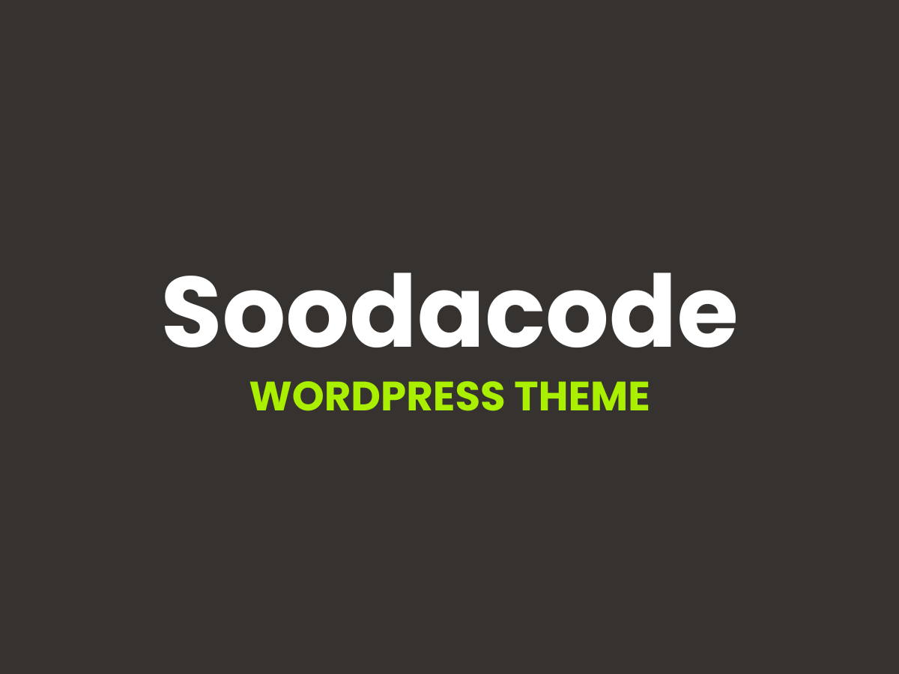

# Soodacode - WordPress Custom Theme



Un tema personalizado de WordPress creado para bloggers y desarrolladores que buscan un diseño moderno, rápido y totalmente personalizable.

## ✨ Características

- **Tabla de Contenidos Automática** - Shortcode `[sooda-toc]` para generar una tabla de contenidos interactiva
- **Imágenes en Categorías** - Añade imágenes a tus categorías desde el admin de WordPress
- **Google Analytics Integrado** - Configura tu código GA desde el personalizador del tema
- **Soporte SVG** - Sube archivos SVG directamente sin problemas
- **Características de YouTube** - Sistema personalizado para integrar contenido de YouTube
- **Fotos de Perfil Personalizadas** - Gestiona imágenes de perfil de autores
- **Responsive y Moderno** - Construido con HTML5 y CSS personalizado
- **Remixicon** - Librería completa de iconos con Remix Icon
- **Esquema Admin Personalizado** - Tema de color verde y negro para el panel de administración

## 🚀 Instalación

1. Descarga los archivos del tema
2. Sube la carpeta `soodacode` a `/wp-content/themes/`
3. Activa el tema desde el panel de administración de WordPress

## 📁 Estructura

```
soodacode/
├── inc/              # Funcionalidades personalizadas
├── js/               # Scripts del tema
├── css/              # Estilos personalizados
├── template-parts/   # Partes reutilizables
├── functions.php     # Funciones principales
└── style.css         # Hoja de estilos principal
```

## 🔧 Requisitos

- WordPress 5.0+
- PHP 7.4+

## 📄 Licencia

Este theme está bajo la licencia GNU General Public License v2.0 (GPLv2). [Detalles sobre la licencia](http://www.gnu.org/licenses/gpl-2.0.html)

---

Hecho con 💚 por Fernando Morenilla
